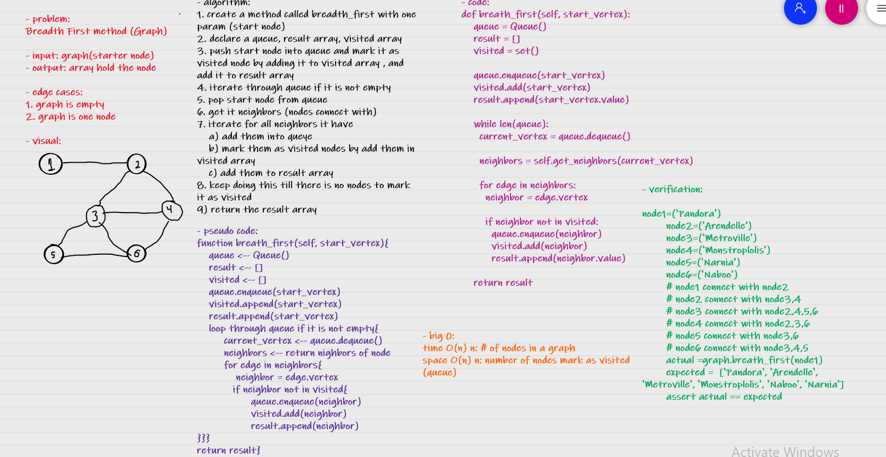

# Challenge Summary
Breadth First (Graph)

## Whiteboard Process

## Approach & Efficiency
time O(n) n: # of nodes in a graph
space O(n) n: number of nodes mark as visited (queue)

## Solution

        node1=('Pandora')
        node2=('Arendelle')
        node3=('Metroville')
        node4=('Monstroplolis')
        node5=('Narnia')
        node6=('Naboo')
        # node1 connect with node2
        # node2 connect with node3,4
        # node3 connect with node2,4,5,6
        # node4 connect with node2,3,6
        # node5 connect with node3,6
        # node6 connect with node3,4,5
        actual =graph.breath_first(node1)
        expected =  ['Pandora', 'Arendelle', 'Metroville', 'Monstroplolis', 'Naboo', 'Narnia']
        assert actual == expected