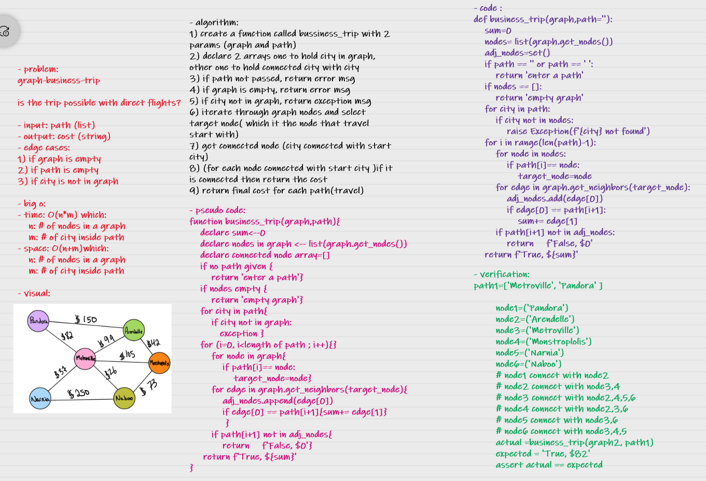

# Challenge Summary
graph-business-trip

is the trip possible with direct flights?
## Whiteboard Process

## Approach & Efficiency
- time: O(n*m) 

which:

    n: # of nodes in a graph
    m: # of city inside path

- space: O(n+m)

which: 

    n: # of nodes in a graph
    m: # of city inside path 

## Solution

        path1=['Metroville', 'Pandora' ]

        node1=('Pandora')
        node2=('Arendelle')
        node3=('Metroville')
        node4=('Monstroplolis')
        node5=('Narnia')
        node6=('Naboo')
        # node1 connect with node2
        # node2 connect with node3,4
        # node3 connect with node2,4,5,6
        # node4 connect with node2,3,6
        # node5 connect with node3,6
        # node6 connect with node3,4,5
        actual =business_trip(graph2, path1)
        expected = 'True, $82'
        assert actual == expected