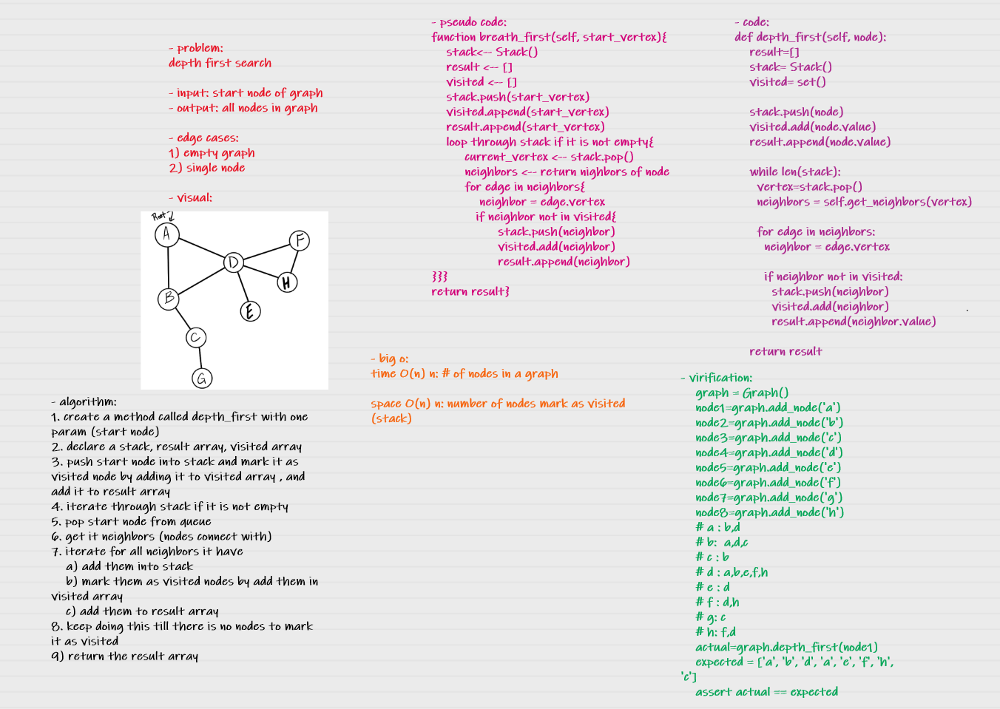

# Depth First Traversal
Depth First Traversal (or Search) for a graph is similar to Depth First Traversal of a tree. The only catch here is, unlike trees, graphs may contain cycles (a node may be visited twice). To avoid processing a node more than once, use a boolean visited array. 

## whitboard process

## Challenge
depth first search in a graph

## Approach & Efficiency
- big 0:

time O(n) n: # of nodes in a graph

space O(n) n: number of nodes mark as visited (stack)

## Solution

    graph = Graph()
    node1=graph.add_node('a')
    node2=graph.add_node('b')
    node3=graph.add_node('c')
    node4=graph.add_node('d')
    node5=graph.add_node('e')
    node6=graph.add_node('f')
    node7=graph.add_node('g')
    node8=graph.add_node('h')
    # a : b,d
    # b:  a,d,c
    # c : b
    # d : a,b,e,f,h
    # e : d
    # f : d,h
    # g: c
    # h: f,d
    actual=graph.depth_first(node1)
    expected = ['a', 'b', 'd', 'a', 'e', 'f', 'h', 'c']
    assert actual == expected