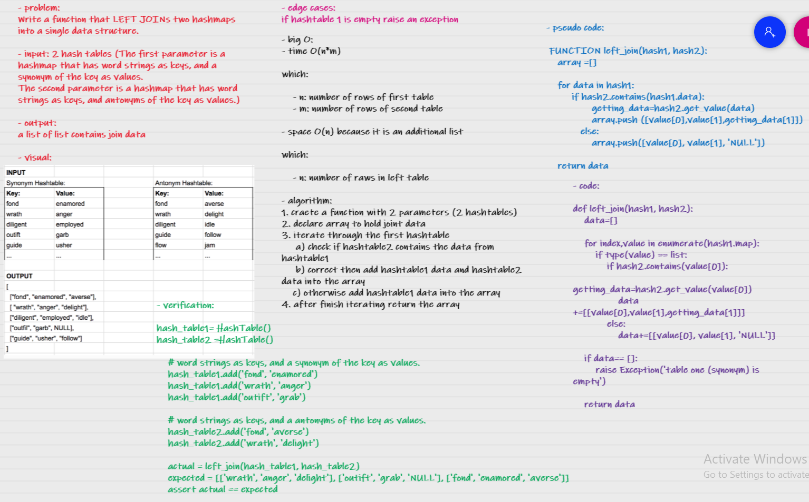

# Hashmap LEFT JOIN
The SQL LEFT JOIN returns all rows from the left table, even if there are no matches in the right table.

## Challenge
Write a function that LEFT JOINs two hashmaps into a single data structure.

## whiteboard process

## Approach & Efficiency
- time O(n*m)

which:

    - n: number of rows of first table
    - m: number of rows of second table

- space O(n) because it is an additional list  

which:

    - n: number of raws in left table 

## Solution

    hash_table1= HashTable()
    hash_table2 =HashTable()

    # word strings as keys, and a synonym of the key as values.
    hash_table1.add('fond', 'enamored')
    hash_table1.add('wrath', 'anger')
    hash_table1.add('diligent', 'employed')
    hash_table1.add('outift', 'grab')
    hash_table1.add('guide', 'usher')

    # word strings as keys, and a antonyms of the key as values.
    hash_table2.add('fond', 'averse')
    hash_table2.add('wrath', 'delight')
    hash_table2.add('diligent','idle')
    hash_table2.add('guide','follow')
    hash_table2.add('flow','jam')

    actual = left_join(hash_table1, hash_table2)
    expected = [['wrath', 'anger', 'delight'], ['outift', 'grab', 'NULL'], ['diligent', 'employed', 'idle'], ['guide', 'usher', 'follow'], ['fond', 'enamored', 'averse']]
    assert actual == expected
    