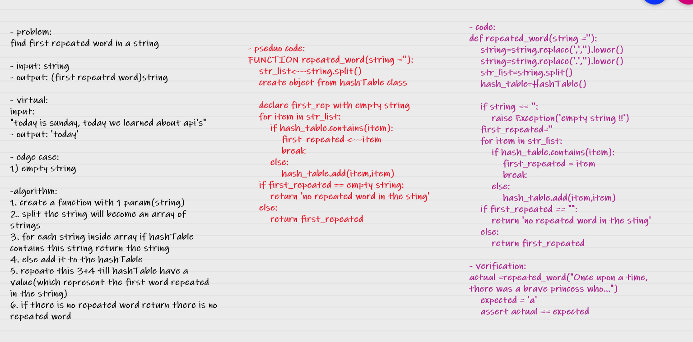

# Challenge Summary
find the first repeated word in a string

## Whiteboard Process

## Approach & Efficiency
time: O(n)

space: O(1)

[code link](hashmap_repeated_word.hash_repeate_word)

## Solution
    actual =repeated_word("Once upon a time, there was a brave princess who...")
    expected = 'a'
    assert actual == expected
    