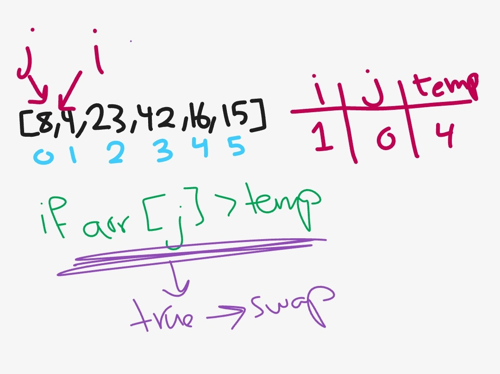
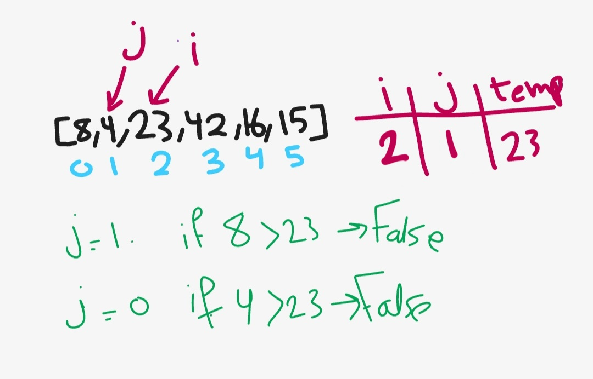
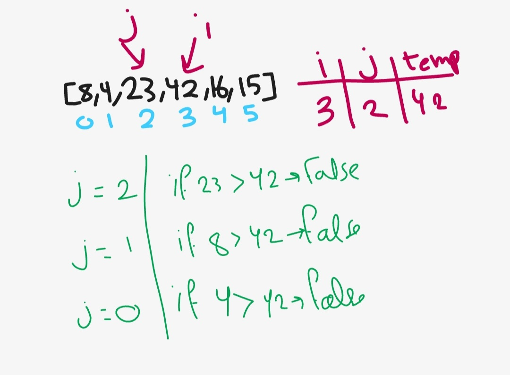
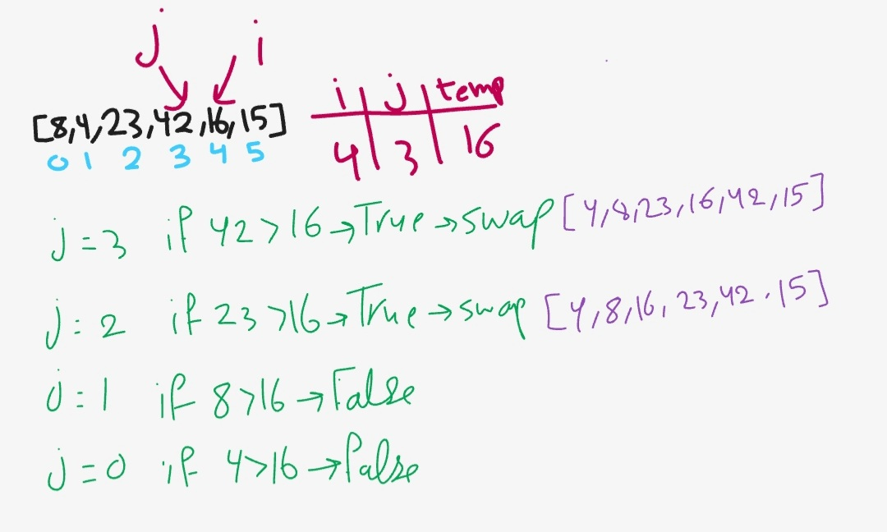
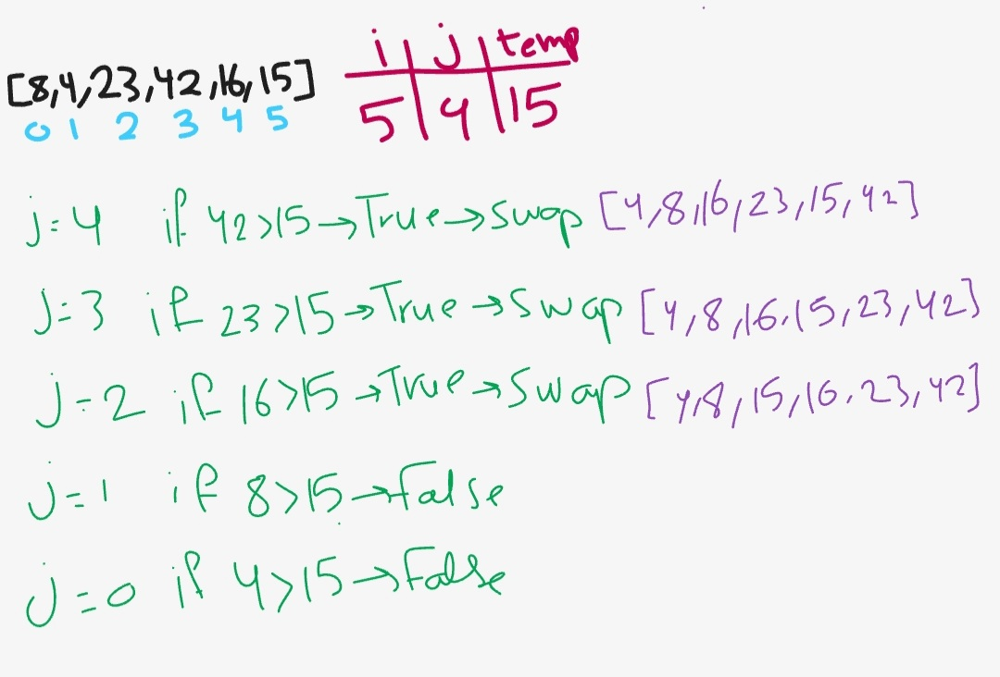
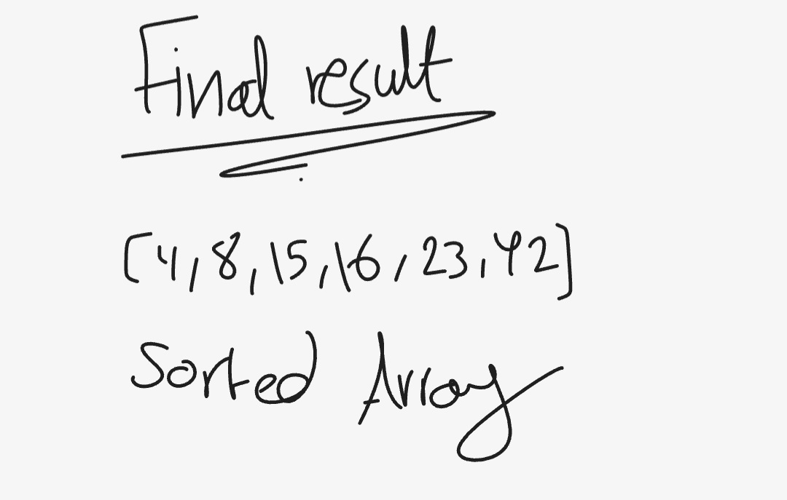

# insertion sort
Insertion Sort is a sorting algorithm that traverses the array multiple times after it is created. The array is virtually split into a sorted and an unsorted part. Values from the unsorted part are picked and placed at the correct position in the sorted part.

## Pseudocode
```
function InsertionSort(int[] arr)

    FOR i = 1 to arr.length

      int j <-- i - 1
      int temp <-- arr[i]

      WHILE j >= 0 AND temp < arr[j]
        arr[j + 1] <-- arr[j]
        j <-- j - 1

      arr[j + 1] <-- temp

```

## Trace

**original array (before sorting)**
`[8,4,23,42,16,15]`

1. for iteration 1

2. for iteration 2

3. for iteration 3

4. for iteration 4

5. for iteration 5


**final result**



## Efficency (big O):

- time: O(n^2)

    the worst case if the array sorted in reverse order.

        Ex: [20,18,12,8,5,-2]

- space: O(1)
    
    we did not use any additinal spaces