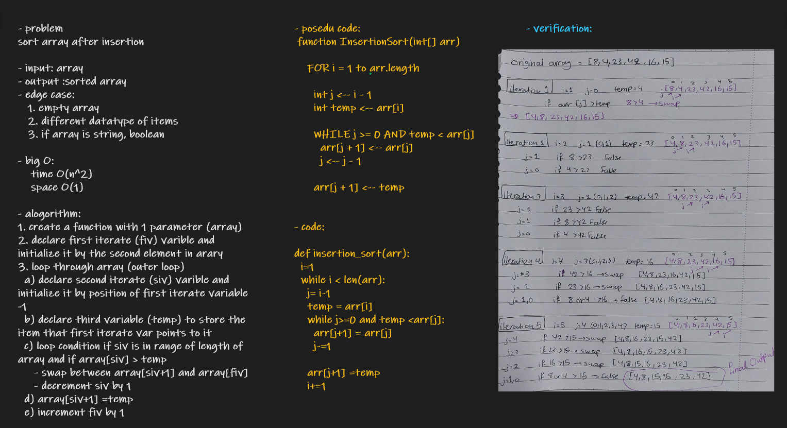

# Challenge Summary
sort array after insertion

## Whiteboard Process

## blog link
[link](./Blog.md)

## Approach & Efficiency

- big O:

    time O(n^2)

    space O(1)

## Solution

    actual = insertion_sort([8,4,23,42,16,15])
    expected = [4, 8, 15, 16, 23, 42]
    assert actual == expected
