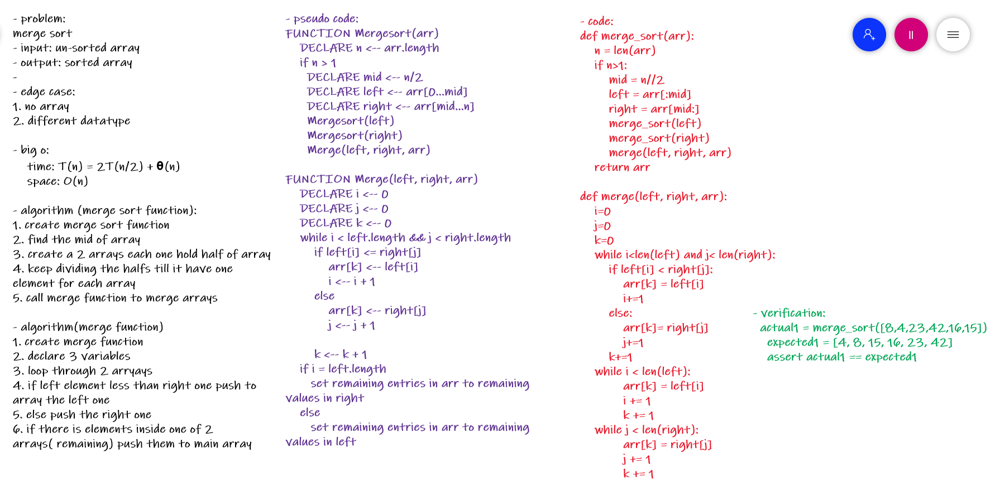

# Challenge Summary
merge sorting 

## Whiteboard Process

# blog link
[blog](blog.md)
## Approach & Efficiency
big 0:

    - time: T(n) = 2T(n/2) + θ(n)
    - space: O(n)

## Solution

    actual1 = merge_sort([8,4,23,42,16,15])
    expected1 = [4, 8, 15, 16, 23, 42]
    assert actual1 == expected1