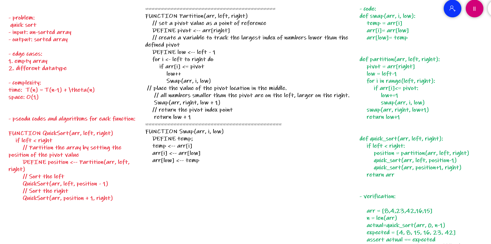

# Challenge Summary
quick sort

## Whiteboard Process

## blog link
[blog](blog.md)
## Approach & Efficiency
time:  T(n) = T(n-1) + \theta(n)
space: O(1)

## Solution

    arr = [8,4,23,42,16,15]
    n = len(arr)
    actual=quick_sort(arr, 0, n-1)
    expected = [4, 8, 15, 16, 23, 42]
    assert actual == expected