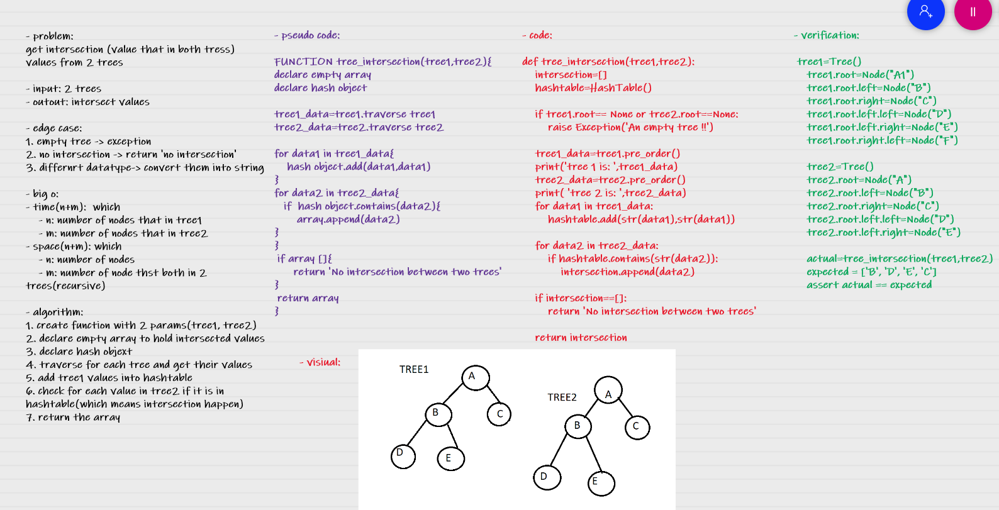

# Challenge Summary
get intersection (value that in both tress) values from 2 trees

## Whiteboard Process

## Approach & Efficiency
- time(n+m)

which 

    - n: number of nodes that in tree1
    - m: number of nodes that in tree2
- space(n+m): 

which 

    - n: number of nodes
    - m: number of node thst both in 2 trees

## Solution
    tree1=Tree()
    tree1.root=Node("A1")
    tree1.root.left=Node("B")
    tree1.root.right=Node("C")
    tree1.root.left.left=Node("D")
    tree1.root.left.right=Node("E")

    tree2=Tree()
    tree2.root=Node("A")
    tree2.root.left=Node("B")
    tree2.root.right=Node("C")
    tree2.root.left.left=Node("D")
    tree2.root.left.right=Node("E")

    actual=tree_intersection(tree1,tree2)
    expected = ['B', 'D', 'E', 'C']
    assert actual == expected
