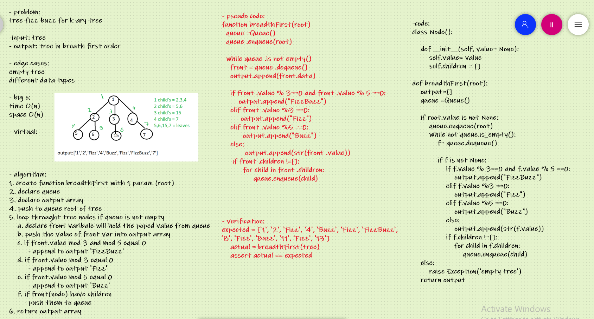

# Challenge Summary
tree-fizz-buzz for k-ary tree

## Whiteboard Process

## Approach & Efficiency
`time O(n)` loop through each node if tree

`space O(n)` use queue methods enqueue and dequeue for each node

## Solution

    expected = ['1', '2', 'Fizz', '4', 'Buzz', 'Fizz', 'FizzBuzz', '8', 'Fizz', 'Buzz', '11', 'Fizz', '13']
    actual = breadthFirst(tree)
    assert actual == expected
    