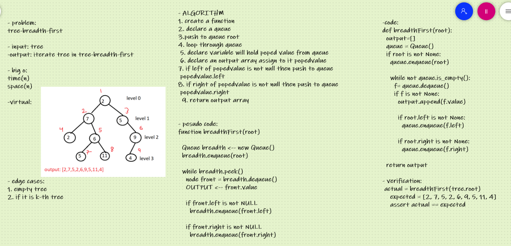

# Challenge Summary
Breadth first traversal iterates through the tree by going through each level of the tree node-by-node

## Whiteboard Process

## Approach & Efficiency
time O(n)

space O(n)

## Solution

    actual = breadthFirst(tree.root)
    expected = [2, 7, 5, 2, 6, 9, 5, 11, 4]
    assert actual == expected
    